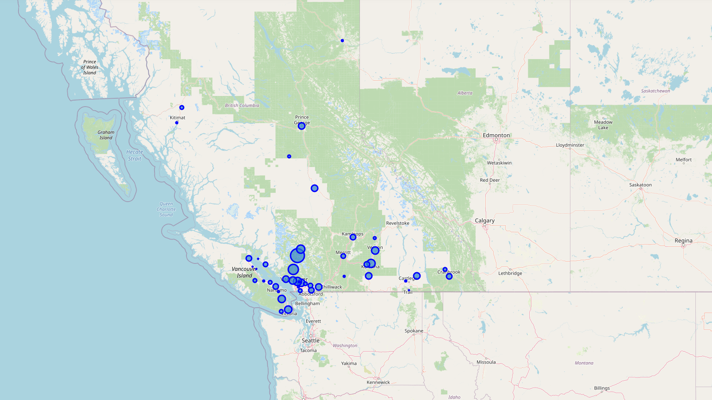

# Introduction
I am a bit of a nomad. I have moved from place to place roughly every 6 months for the last 10 years. I am a "professional" (I use the term loosely as I only recieve parts & gear, but no paycheck) mountain biker. My life more or less revolves around the sport. As such, the majority of the places I have moved to have been because there is an abundance of excellent mountain bike trails in the area. There are two major areas that I have spent more time at than most others. They are Southwest Utah, and Whistler, British Colombia. Both places are incredible. Southern Utah is incredible in the winter due to the mild weather and lack of snow, while Whistler is the place to be in the summer due to the Whistler Bike Park (it's by far the largest bike park in the world).

Unfortunately, the world is currently in a complete shutdown due to the COVID-19 pandemic. As much as I would love to return to Whistler in the summer, I am unsure if the bikepark will be open, so I would like to explore other options in British Colombia. UPDATE: The bike park opened, but as I am an American, I wasn't allowed to enter Canada. Hopefully next year!

# Data
I hope to use Data Science in order to help me find a solution to the problem, "Where should I live this year?". I will be leveraging the Foursquare API, web scraping trail data from trailforks.com, and also scraping postal codes from wikipedia in order to gather data that I can use for my analysis. Foursquare has a wonderful database of location data, and Trailforks has a database of trail data. I will try to pin point a few possible neighborhoods that I would like to live at based off of location data of avaiable nearby amenities, nearby hospitals (mountainbiking is quite dangerous), distance to major airports (I love to travel), and of course, how many high quailty trails are in the area. I will be using geocoder combined with the postal codes in order to get the geospacial coordinates of each area and then using those to get nearby venue data from Foursquare.

# Examples
#### : Map of Trail Bubbles

#### Clustered Cities

#### Whistler's Cluster
